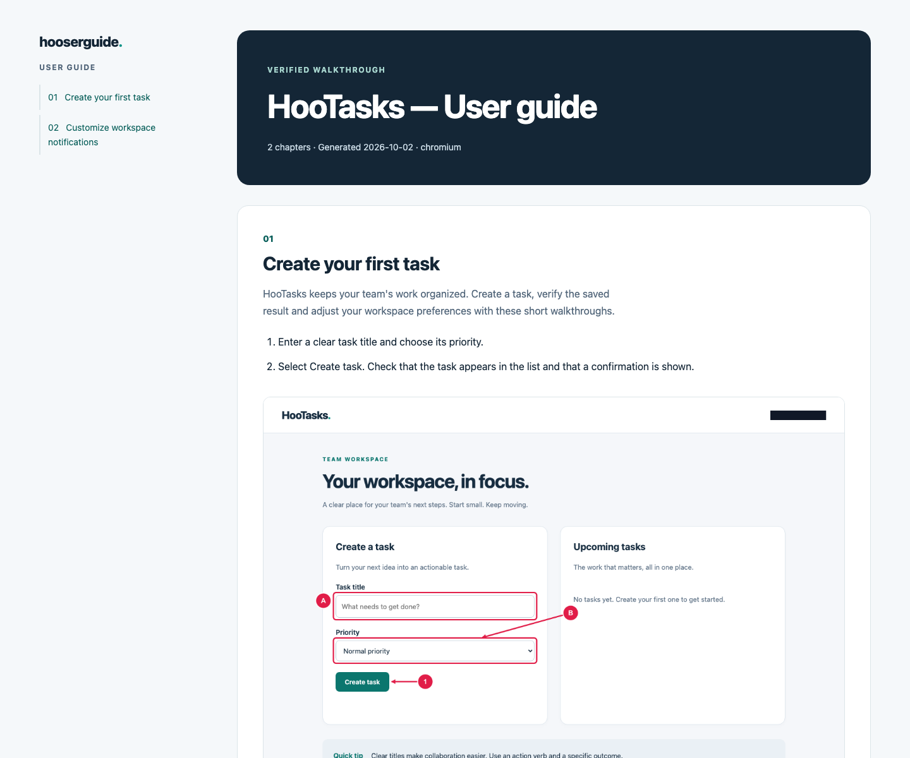
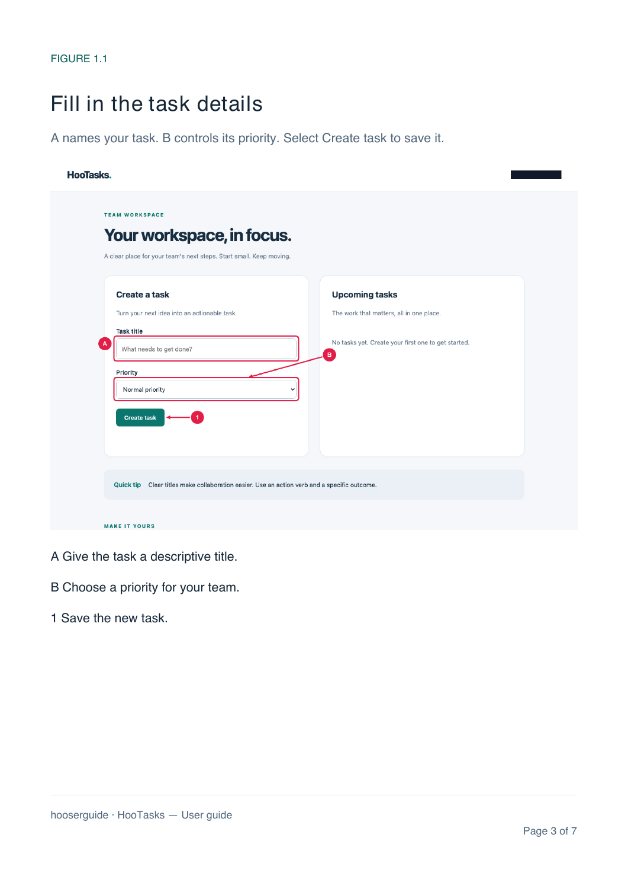

<p align="center">
  
</p>

<p align="center">
  <a href="https://github.com/openhoo/hooserguide/actions/workflows/ci.yml"></a>
  
  
  
</p>

<h3 align="center">From real workflows to a guide people can follow.</h3>

Hooserguide turns **Gherkin BDD specs** into verified user manuals. An AI agent writes the workflow, **Playwright** executes it, and screenshots are annotated with **boxes, arrows, numbers and letters**. One command exports a **pdfcn PDF**, a responsive **HTML handbook**, **Markdown** and a **JSON execution report**.

Your existing agent supplies the reasoning. Hooserguide supplies repeatable browser execution, screenshot annotation and document generation. There is no embedded model, model subscription or API key to configure.

## See the annotations

This is an actual screenshot from the included HooTasks demo. The account email is masked in both the original and annotated images.


| Reference | Annotation           | Meaning            |
| --------- | -------------------- | ------------------ |
| **A**     | Box + letter         | Enter a task title |
| **B**     | Box + arrow + letter | Choose a priority  |
| **1**     | Arrow + number       | Save the task      |

After the workflow runs, a second screenshot shows the asserted result:


## See the finished guide

The HTML handbook includes chapter navigation, reference legends, mobile layout and print styles.



The same screenshots and legends are rendered through **pdfcn's Forme components** into an A4 PDF with a cover, chapters, page numbers and readable slices for long screenshots.

<p align="center"></p>

**Explore the complete example:** [PDF](docs/demo/handbook.pdf) · [Markdown](docs/demo/handbook.md) · [HTML source](docs/demo/index.html) · [Execution report](docs/demo/report.json) · [BDD feature](examples/tasks.feature).

## Try it in one minute

Requirements: Node.js **22 or newer** and npm. No external app or credentials are needed for the demo.

```sh
git clone https://github.com/openhoo/hooserguide.git
cd hooserguide
npm ci
npx playwright install chromium
npm run demo
```

The demo starts a temporary local app, executes both workflows and prints paths to the generated handbook. Open the printed `index.html` or `handbook.pdf`.

## Use it in your project

Install directly from GitHub; an npm registry release is not required:

```sh
npm install -D github:openhoo/hooserguide
npm exec playwright -- install chromium
npm exec hooserguide -- init docs/user-guide --base-url http://localhost:3000 --skills
```

Edit the generated `features/get-started.feature` to match your app. Then:

```sh
npm exec hooserguide -- validate --config docs/user-guide/hooserguide.config.json
npm exec hooserguide -- run --config docs/user-guide/hooserguide.config.json
```

The `--skills` option installs authoring and review skills into your project's `.agents/skills/`. For programmatic agents add `--json`. For debugging add `--headed`. PDF is enabled by default; `--no-pdf` skips it.

## A small spec, a complete walkthrough

```gherkin
@manual
Feature: Create tasks
  Create work items and check the saved result.

  Scenario: Create your first task
    Given I open "/"
    When I fill "label=Task title" with "Prepare the launch checklist"
    And I click "role=button:Create task"
    Then "role=status:Task result" has text "Task created successfully."
    And I explain "Enter a task title, select Create task and check the confirmation."
    And I capture "Your saved task"
      """json
      {
        "marks": [
          { "target": "testid=task-list", "kind": "box", "label": "A", "caption": "Your new task." },
          { "target": "role=status:Task result", "kind": "both", "label": "1", "caption": "Successful save confirmation." }
        ]
      }
      """
```

Backgrounds, Scenario Outlines, Examples, tags and localized Gherkin keywords work through the official Cucumber parser. Built-in action phrases remain English. Domain-specific steps can reuse your application's helpers through local plugins.

## Clean integration paths

| Interface          | Best for                                                    |
| ------------------ | ----------------------------------------------------------- |
| **CLI**            | Scripts, CI and agents that can execute commands            |
| **MCP**            | Agents that need generation tools and screenshot inspection |
| **TypeScript API** | Application pipelines and existing Playwright suites        |
| **Agent skills**   | Teaching agents how to author and review a guide            |

Minimal MCP configuration:

```json
{
  "mcpServers": {
    "hooserguide": {
      "command": "node",
      "args": [
        "/absolute/path/hooserguide/dist/cli.js",
        "mcp",
        "--config",
        "/absolute/path/project/hooserguide.config.json"
      ]
    }
  }
}
```

MCP exposes `hooserguide_validate`, `hooserguide_generate`, `hooserguide_inspect_capture` and an `author-user-guide` prompt. The server stays attached to the project config selected at startup.

```ts
import { loadConfig, run } from '@openhoo/hooserguide';

const result = await run(await loadConfig('docs/user-guide/hooserguide.config.json'));
if (result.report.status !== 'passed') throw new Error('Guide generation failed');
console.log(result.artifacts.pdf);
```

See [integration recipes](docs/integration.md) for Codex configuration, custom steps, existing Playwright tests and CI.

## Configuration

```json
{
  "title": "My app — User guide",
  "baseURL": "http://localhost:3000",
  "features": ["features/**/*.feature"],
  "output": "output/guides",
  "tag": "@manual",
  "language": "en",
  "viewport": { "width": 1280, "height": 800 },
  "masks": ["testid=account-email"]
}
```

Paths are relative to the configuration file. Feature files are sorted and deduplicated. `storageState` accepts an existing local Playwright authentication state. `browser` supports `chromium`, `firefox` and `webkit`; install your selected browser first. See [configuration and step reference](docs/reference.md), [config schema](schemas/config.schema.json) and [capture schema](schemas/capture.schema.json).

## What you get

```text
output/guides/run-<timestamp>-<id>/
├── handbook.pdf                 pdfcn / Forme PDF
├── index.html                   Responsive standalone guide
├── handbook.md                  Portable Markdown
├── report.json                  Scenario and step evidence + image hashes
├── pdf-layout.json              Page count and PDF content audit
└── screenshots/
    ├── 01-01.png                Annotated screenshot
    ├── 01-01.raw.png            Masked original
    └── 01-01.overlay.svg        Reusable vector annotation layer
```

Each run has its own directory. Failed assertions, missing masks, ambiguous targets and undefined steps fail the run. A failed run retains available evidence and **does not export a successful handbook**. The tool never changes the page's content to draw annotations; a temporary stylesheet freezes motion for capture, and the annotations are composited onto the PNG.

## Agent skills

- [**hooserguide-author**](skills/hooserguide-author/SKILL.md): inspect the app, write meaningful BDD workflows, mask private data and produce the handbook.
- [**hooserguide-review**](skills/hooserguide-review/SKILL.md): check execution evidence, reference accuracy, privacy masks and actual rendered PDF pages.

Install with `init --skills`, or copy these folders into your agent's skill directory. Both skills are plain Markdown and can be used by other agent runtimes.

## Development

```sh
npm ci
npx playwright install chromium
npm run check
npm test
npm run build
```

Tests exercise real browser coordinates and image pixels, privacy masks, scrolled pages, failing saved-state assertions, PDF rendering/text, Gherkin outlines, escaping, initialization and MCP. See [CONTRIBUTING](CONTRIBUTING.md) and the [architecture notes](docs/architecture.md).

## Scope and limitations

- An agent writes the features using its own browser and file tools. Hooserguide executes declared workflows; it does not discover an application autonomously.
- Specs and step plugins are trusted local inputs. They can interact with and change the target app. Use workflows and accounts you are authorized to operate.
- Screenshots cover the workflows in your specs. Successful generation does not establish coverage of every application feature or durable persistence unless your steps assert it.
- Standard PDF fonts support common Latin text. Other scripts may require embedded fonts and a custom theme. Tagged PDF output is enabled; PDF/UA conformance is not claimed.
- Dynamic content can still move during capture. Use stable app states and assertions, then visually review the output. Very large full-page captures may hit browser/image limits.

## License

Hooserguide is **Apache-2.0**. Vendored [pdfcn](https://github.com/shadcn-labs/pdfcn) components retain their **MIT** license and attribution. See [LICENSE](LICENSE), [NOTICE](NOTICE) and [third-party notices](THIRD_PARTY_NOTICES.md).
