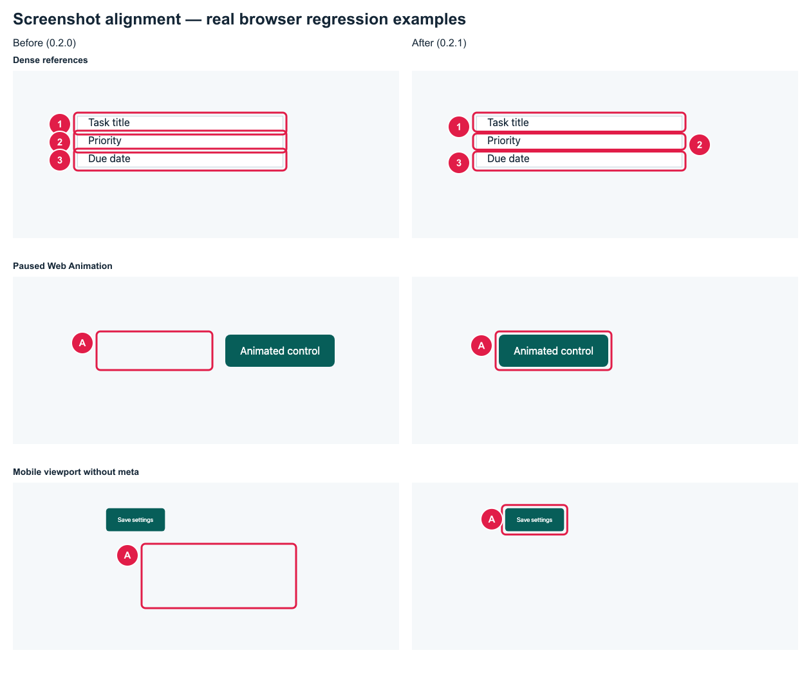
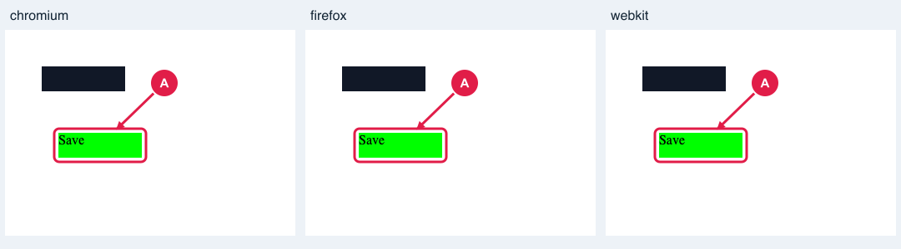
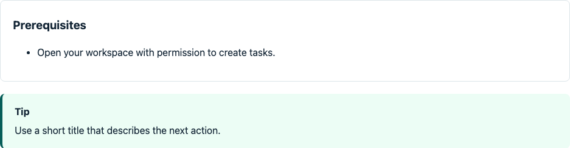
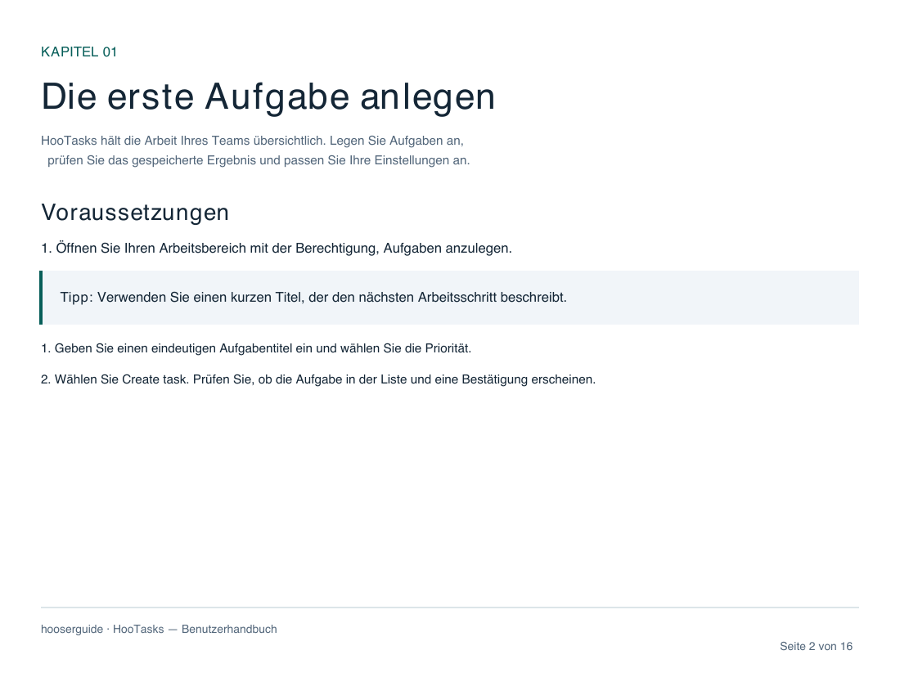
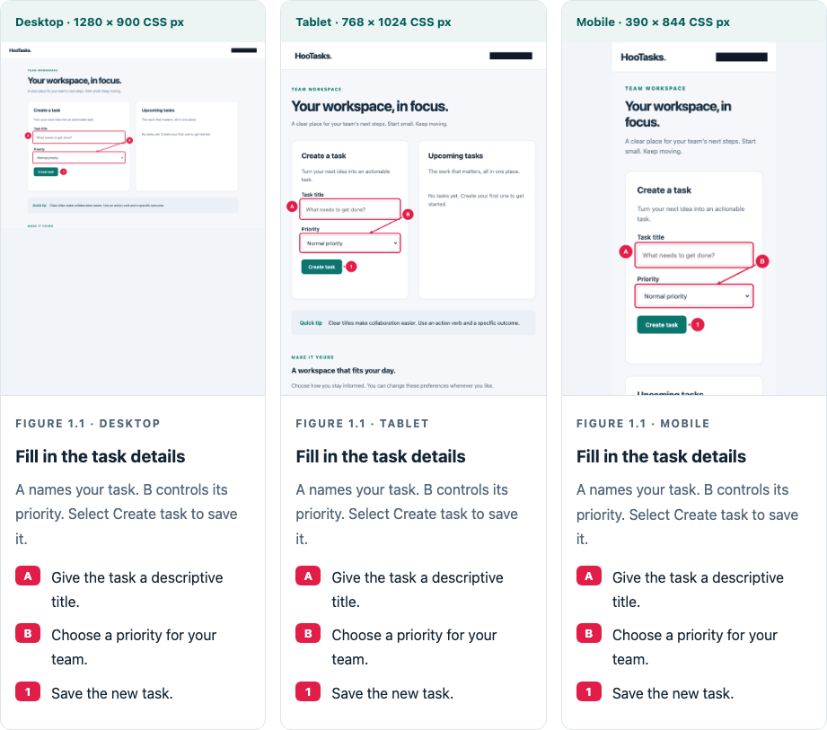

<p align="center">
  
</p>

<p align="center">
  <a href="https://github.com/openhoo/hooserguide/actions/workflows/ci.yml"></a>
  
  
  
</p>

<h3 align="center">From real workflows to a guide people can follow.</h3>

Hooserguide turns **Gherkin BDD specs** into verified user manuals. An AI agent writes the workflow, **Playwright** executes it, and screenshots are annotated with **boxes, arrows, numbers and letters**. One command exports a **pdfcn PDF**, a responsive **HTML handbook**, **Markdown** and a **JSON execution report**.

Your existing agent supplies the reasoning. Hooserguide supplies repeatable browser execution, screenshot annotation and document generation. There is no embedded model, model subscription or API key to configure.

## See the annotations

This is an actual screenshot from the included HooTasks demo. The account email is masked in both the original and annotated images.


| Reference | Annotation           | Meaning            |
| --------- | -------------------- | ------------------ |
| **A**     | Box + letter         | Enter a task title |
| **B**     | Box + arrow + letter | Choose a priority  |
| **1**     | Arrow + number       | Save the task      |

After the workflow runs, a second screenshot shows the asserted result:


## See the finished guide

The HTML handbook includes chapter navigation, offline search, annotated/original image switching, prerequisites and callouts, mobile layout and print controls.


The same screenshots and legends are rendered through **pdfcn's Forme components** into a configurable A4 or Letter PDF, in portrait or landscape, with a cover, chapters, page numbers and readable slices for long screenshots.

<p align="center"></p>

**Explore the complete example:** [ZIP bundle](docs/demo/handbook.zip) · [PDF](docs/demo/handbook.pdf) · [Markdown](docs/demo/handbook.md) · [HTML source](docs/demo/index.html) · [Execution report](docs/demo/report.json) · [BDD feature](examples/tasks.feature).

## Alignment and layout review

Version 0.2.1 corrects mobile viewport scaling, animation timing, overlapping reference badges and edge outlines. PDF captions paginate safely, and long screenshot slices keep annotation groups together where possible.

These are real browser regression captures comparing the pinned 0.2.0 implementation with the corrected renderer:



See the [review evidence and remaining limits](docs/review.md). Maintainers can reproduce this comparison with `npm run review:gallery`.

## New in 0.6

- **Automatic Pages publishing:** reusable GitLab Pages component and GitHub generation/Pages-upload actions.
- Verified static export with responsive HTML, PDF/ZIP downloads, sanitized evidence and success-only deployments.
- Full pipeline examples, packaged actions and agent guidance for live-site verification.

## New in 0.5

- **Responsive feature presentations:** execute the same BDD scenarios on Desktop, Tablet and Mobile, with annotated screenshots next to each other or stacked.
- Shared CLI, MCP and GitLab selection, profile labels, responsive HTML, Markdown tables and PDF comparison overviews with readable device details.
- Evidence, failure handling, rebuilds, comparisons and bundles retain each screen's independent execution.

## New in 0.4

- A reusable [GitLab CI/CD component](docs/gitlab.md) with typed inputs, readiness checks, browser/profile selection, PDF customization, portable ZIPs and failed-run artifacts.
- Dedicated Linux qualification jobs for Chromium, Firefox and WebKit, covering real workflows, saved-state assertions, high-DPI/masked captures, HTML controls, PDF export and cancellation.

The same high-DPI crop, privacy mask and reference arrow across the three engines:



## New in 0.3

- **Choose the workflows:** Cucumber tag expressions, scenario-name filters and fail-fast with explicit skipped coverage.
- **Explain the task:** prerequisites and styled notes, tips and warnings in every export.
- **Customize the manual:** guide/product version, audience, summary, German/English labels and optional dates/contents.
- **Choose PDF geometry:** A4 or Letter, portrait or landscape and configurable margins, still powered by pdfcn.
- **Set screenshot defaults:** automatic letters/numbers, mark color, crop padding and full-page behavior with local overrides.
- **Read offline:** search chapters, switch masked raw/annotated screenshots and print the whole guide.
- **Review changes:** verified report inspection and run comparison distinguish prose, annotation and screenshot changes.
- **Share one file:** portable ZIP with manuals, masked screenshots and a hash manifest.
- **Integrate agents:** nine MCP tools plus project and exact-run artifact resources; both skills cover the new workflow.

The offline reader adds these controls without external dependencies:


Prerequisites and tips render as clear chapter guidance:



A German Letter landscape export uses the same pdfcn pipeline:

<p align="center"></p>

[Open the landscape example](docs/layout-demo/handbook.pdf) · [See all customization options](docs/customization.md).

## Screenshot and workflow features

- **Focused screenshots:** capture one form, panel or dialog with padding and aligned annotations.
- **Automatic references:** number or letter your marks, with explicit labels preserved and duplicates rejected.
- **More BDD steps:** form tables, uploads, hover, double-click, drag-and-drop, browser history and saved-state checks after reload.
- **Named profiles:** run desktop or mobile workflows with viewport, touch, scale factor, browser and color scheme settings.
- **Evidence-only rebuilds:** export again without interacting with the app; screenshot hashes and dimensions are checked first.
- **Branding:** customize the guide name, subtitle and accent color across HTML and pdfcn PDF.
- **Agent discovery:** list every step with examples via CLI or MCP, including documented custom plugins.

This detail view uses `focus` and automatically assigned A/B/C references. The blue reference and its legend keep the mark's configured color.

<p align="center"></p>

## Try it in one minute

Requirements: Node.js **22 or newer** and npm. No external app or credentials are needed for the demo.

```sh
git clone https://github.com/openhoo/hooserguide.git
cd hooserguide
npm ci
npx playwright install chromium
npm run demo
```

The demo starts a temporary local app, executes both workflows and prints paths to the generated handbook. Open the printed `index.html` or `handbook.pdf`.

## Use it in your project

Install directly from GitHub; an npm registry release is not required:

```sh
npm install -D github:openhoo/hooserguide
npm exec playwright -- install chromium
npm exec hooserguide -- init docs/user-guide --base-url http://localhost:3000 --skills
```

Edit the generated `features/get-started.feature` to match your app. Then:

```sh
npm exec hooserguide -- validate --config docs/user-guide/hooserguide.config.json
npm exec hooserguide -- run --config docs/user-guide/hooserguide.config.json
```

The `--skills` option installs authoring and review skills into your project's `.agents/skills/`. For programmatic agents add `--json`. For debugging add `--headed`. PDF is enabled by default; `--no-pdf` skips it.

Discover the supported steps or regenerate an existing guide without rerunning the app:

```sh
npm exec hooserguide -- steps --json
npm exec hooserguide -- run --config docs/user-guide/hooserguide.config.json --profile mobile
npm exec hooserguide -- build output/guides/run-<timestamp>-<id> --output output/rebuilt
```

See [advanced workflows](docs/advanced.md) for focused captures, profiles and rebuilds, and [customization](docs/customization.md) for layout, guidance, workflow filters, comparison and sharing.

## A small spec, a complete walkthrough

```gherkin
@manual
Feature: Create tasks
  Create work items and check the saved result.

  Scenario: Create your first task
    Given I open "/"
    When I fill "label=Task title" with "Prepare the launch checklist"
    And I click "role=button:Create task"
    Then "role=status:Task result" has text "Task created successfully."
    And I explain "Enter a task title, select Create task and check the confirmation."
    And I capture "Your saved task"
      """json
      {
        "marks": [
          { "target": "testid=task-list", "kind": "box", "label": "A", "caption": "Your new task." },
          { "target": "role=status:Task result", "kind": "both", "label": "1", "caption": "Successful save confirmation." }
        ]
      }
      """
```

Backgrounds, Scenario Outlines, Examples, tags and localized Gherkin keywords work through the official Cucumber parser. Built-in action phrases remain English. Domain-specific steps can reuse your application's helpers through local plugins.

## Clean integration paths

| Interface          | Best for                                                    |
| ------------------ | ----------------------------------------------------------- |
| **CLI**            | Scripts, CI and agents that can execute commands            |
| **MCP**            | Agents that need generation tools and screenshot inspection |
| **TypeScript API** | Application pipelines and existing Playwright suites        |
| **Agent skills**   | Teaching agents how to author and review a guide            |

Minimal MCP configuration:

```json
{
  "mcpServers": {
    "hooserguide": {
      "command": "node",
      "args": [
        "/absolute/path/hooserguide/dist/cli.js",
        "mcp",
        "--config",
        "/absolute/path/project/hooserguide.config.json"
      ]
    }
  }
}
```

MCP exposes nine tools: project status, step discovery, validation, generation, exact run inspection, verified screenshot inspection, rebuild, run comparison and ZIP packaging. Read-only project and run artifact resources support client context attachment. Both `author-user-guide` and `review-user-guide` prompts guide agents through the workflow. Save the returned `runId` and pin it when reviewing annotated/raw screenshots or rebuilding; selection survives restarts. Generation supports progress and cancellation. See [MCP contracts and examples](docs/integration.md#recommended-agent-workflow). The server stays attached to the project config selected at startup.

```ts
import { loadConfig, run } from '@openhoo/hooserguide';

const result = await run(await loadConfig('docs/user-guide/hooserguide.config.json'));
if (result.report.status !== 'passed') throw new Error('Guide generation failed');
console.log(result.artifacts.pdf);
```

See [integration recipes](docs/integration.md) for Codex configuration, custom steps, existing Playwright tests and CI.

## Show a feature on Desktop, Tablet and Mobile

Execute the same scenario in multiple screen profiles and show the annotated results next to each other or stacked:

```sh
hooserguide validate --config hooserguide.config.json --profiles desktop,tablet,mobile --scenario "Create task"
hooserguide run --config hooserguide.config.json --profiles desktop,tablet,mobile --scenario "Create task" --screen-layout side-by-side
```

`init` supplies all three profiles. Try the self-contained example with `npm run demo:responsive`. Alternatively enable `responsive` in config:

```json
{
  "responsive": {
    "profiles": ["desktop", "tablet", "mobile"],
    "layout": "side-by-side",
    "labels": { "desktop": "Desktop", "tablet": "Tablet", "mobile": "Mobile" }
  }
}
```



Every screen has its own BDD assertions, privacy masks and annotation coordinates. HTML comparison columns stack on narrow reader screens; Markdown exports a table; PDF adds a comparison overview and readable detail pages. Use `--screen-layout stacked` for individual views or change the presentation later with `build`. MCP and GitLab expose the same selection. See the [responsive guide](docs/responsive.md) for configuration, evidence review and repeated workflow behavior.

## Automatically publish to Pages

**GitLab:** add the Pages component after your generating job:

```yaml
- remote: https://raw.githubusercontent.com/openhoo/hooserguide/0.7.1/templates/pages/template.yml
  inputs:
    generate-job: user-guide
    source: output/user-guide
```

Include `deploy` in your pipeline stages. This job uses GitLab 17.10+ and publishes on the default branch after successful generation.

**GitHub:** use the generation action and hand its exact output to the Pages action:

```yaml
- uses: openhoo/hooserguide/actions/generate@0.7.1
  id: guide
  with:
    config: docs/user-guide/hooserguide.config.json
    profiles: desktop,tablet,mobile
- uses: openhoo/hooserguide/actions/pages@0.7.1
  with:
    run-directory: ${{ steps.guide.outputs.directory }}
```

A dependent deployment job uses `actions/deploy-pages@v4` with Pages/OIDC permissions. Select GitHub Actions as the repository's Pages source. Both platforms publish only successful, verified output with masked screenshots and PDF/ZIP downloads. See [complete Pages workflows](docs/pages.md) for setup, inputs, app startup and exact live-site checks.

## GitLab CI/CD component

Include the pinned template directly from GitHub:

```yaml
include:
  - remote: https://raw.githubusercontent.com/openhoo/hooserguide/0.7.1/templates/generate/template.yml
    inputs:
      config: docs/user-guide/hooserguide.config.json
      browser: chromium
      base-url: http://127.0.0.1:3000
      wait-url: http://127.0.0.1:3000/health
      before-script:
        - npm ci
        - npm run start > /tmp/hooserguide-app.log 2>&1 &
```

The job exports PDF, HTML, Markdown, verified screenshots, a status summary and an optional portable ZIP. Failed workflows fail the job and preserve available evidence. Package installation is isolated from the app's dependencies, and uploads are scoped to the current job ID. Configure profiles, filters, page geometry, services, rules and dependencies through inputs. The [GitLab guide](docs/gitlab.md) covers native component includes after importing the repository into your GitLab instance, all inputs and artifact review. Hosting on GitHub does not register the component in GitLab's catalog.

## Configuration

```json
{
  "title": "My app — User guide",
  "baseURL": "http://localhost:3000",
  "features": ["features/**/*.feature"],
  "output": "output/guides",
  "tag": "@manual",
  "language": "en",
  "viewport": { "width": 1280, "height": 800 },
  "masks": ["testid=account-email"]
}
```

Paths are relative to the configuration file. Feature files are sorted and deduplicated. `storageState` accepts an existing local Playwright authentication state. `browser` supports `chromium`, `firefox` and `webkit`; install your selected browser first. See [configuration and step reference](docs/reference.md), [config schema](schemas/config.schema.json) [capture schema](schemas/capture.schema.json) and [report schema](schemas/report.schema.json).

## Manual themes

Choose a preset for both HTML and PDF with `manual.theme`:

```json
{
  "manual": { "theme": "midnight" },
  "branding": { "name": "Acme" }
}
```

| Theme                    | Appearance                   |
| ------------------------ | ---------------------------- |
| `professional` (default) | Light, slate and teal        |
| `ocean`                  | Light, blue                  |
| `forest`                 | Light, green                 |
| `sand`                   | Light, warm paper and bronze |
| `midnight`               | Dark, navy and sky blue      |
| `graphite`               | Dark, charcoal and lavender  |

```sh
hooserguide run --config hooserguide.config.json --theme forest
hooserguide build output/guides/<run> --output output/midnight --theme midnight
```

HTML readers can switch themes at the top of the handbook and download the PDF
using the adjacent **Download PDF** button. The download also works without
JavaScript when a PDF was generated. The selected theme is saved for that
handbook path when browser storage is available. The configured theme also works
without JavaScript. Browser printing uses a light palette; the downloadable PDF
retains the configured theme. Switching the HTML theme does not regenerate the PDF.
Screenshots and their annotations retain their evidence colors in every theme.
Markdown has no theme styling.

`branding.accentColor` overrides the accent in all presets; choose a color that
remains readable on the backgrounds you offer. The built-in palettes use text
contrasts of at least 4.5:1. Library users can import `manualThemeNames`,
`manualThemes` and `resolveManualTheme` to discover the presets.

## What you get

```text
output/guides/run-<timestamp>-<id>/
├── handbook.pdf                 pdfcn / Forme PDF
├── index.html                   Responsive standalone guide
├── handbook.md                  Portable Markdown
├── report.json                  Scenario and step evidence + image hashes
├── pdf-layout.json              Page count and PDF content audit
└── screenshots/
    ├── 01-01.png                Annotated screenshot
    ├── 01-01.raw.png            Masked original
    └── 01-01.overlay.svg        Reusable vector annotation layer
```

Each run has its own directory. All evidence readers reject contradictory success records, duplicate screenshot references and invalid annotation geometry. Direct renderers verify both PNG variants before exporting. Failed assertions, missing masks, ambiguous targets and undefined steps fail the run. A failed run retains available evidence and **does not export a successful handbook**. The tool never changes the page's content to draw annotations; a temporary stylesheet freezes motion for capture, and the annotations are composited onto the PNG.

## Agent skills

- [**hooserguide-author**](skills/hooserguide-author/SKILL.md): inspect the app, write meaningful BDD workflows, mask private data and produce the handbook.
- [**hooserguide-review**](skills/hooserguide-review/SKILL.md): check execution evidence, reference accuracy, privacy masks and actual rendered PDF pages.

Install with `init --skills`, or copy these folders into your agent's skill directory. Both skills are plain Markdown and can be used by other agent runtimes.

## Development

```sh
npm ci
npx playwright install chromium firefox webkit
npm run check
npm test
npm run test:browsers
npm run build
npm run test:package
```

Tests exercise real browser coordinates and image pixels, privacy masks, scrolled pages, failing saved-state assertions, PDF rendering/text, Gherkin outlines, escaping, initialization and MCP. See [CONTRIBUTING](CONTRIBUTING.md) and the [architecture notes](docs/architecture.md).

## Scope and limitations

- An agent writes the features using its own browser and file tools. Hooserguide executes declared workflows; it does not discover an application autonomously.
- Specs and step plugins are trusted local inputs. They can interact with and change the target app. Use workflows and accounts you are authorized to operate.
- Screenshots cover the workflows in your specs. Successful generation does not establish coverage of every application feature or durable persistence unless your steps assert it.
- Standard PDF fonts support common Latin text. Other scripts may require embedded fonts and a custom theme. Tagged PDF output is enabled; PDF/UA conformance is not claimed.
- Dynamic content can still move during capture. Use stable app states and assertions, then visually review the output. Very large full-page captures may hit browser/image limits.

## License

Hooserguide is **Apache-2.0**. Vendored [pdfcn](https://github.com/shadcn-labs/pdfcn) components retain their **MIT** license and attribution. See [LICENSE](LICENSE), [NOTICE](NOTICE) and [third-party notices](THIRD_PARTY_NOTICES.md).
