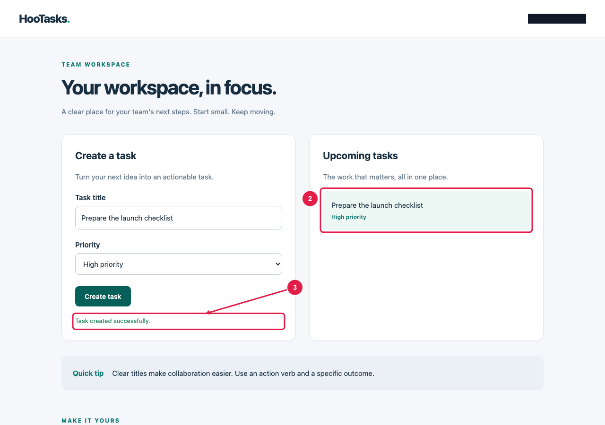
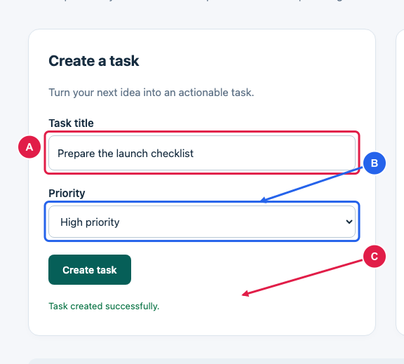
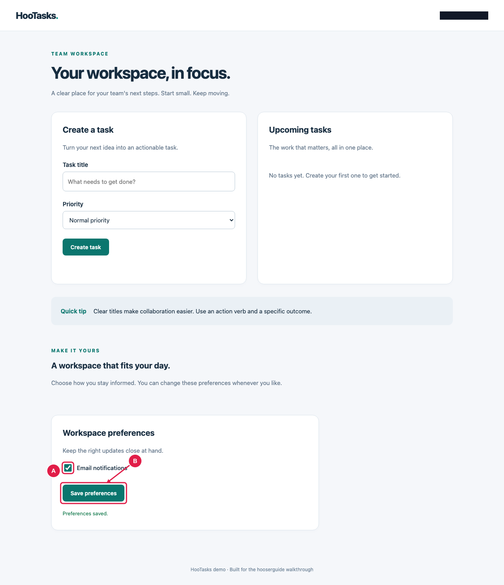

# HooTasks — User guide

Guide version: 1.0
Audience: Workspace members
Generated: 2026-10-07

Create, organize and verify tasks in your HooTasks workspace.

## Contents

1. Create your first task
2. Customize workspace notifications

## 1. Create your first task

HooTasks keeps your team's work organized. Create a task, verify the saved   result and adjust your workspace preferences with these short walkthroughs.

### Prerequisites

- Open your workspace with permission to create tasks.

> **Tip:** Use a short title that describes the next action.

1. Enter a clear task title and choose its priority.
2. Select Create task. Check that the task appears in the list and that a confirmation is shown.

### Fill in the task details

A names your task. B controls its priority. Select Create task to save it.

- **A**: Give the task a descriptive title.
- **B**: Choose a priority for your team.
- **1**: Save the new task.

### Check the saved task

The task now appears in your workspace. The confirmation shows that the save completed.

- **2**: Your newly created task.
- **3**: Successful save confirmation.

### Task form in detail

A focused view keeps the form readable and assigns references automatically.

- **A**: Your task title.
- **B**: The selected priority.
- **C**: The save confirmation.

## 2. Customize workspace notifications

HooTasks keeps your team's work organized. Create a task, verify the saved   result and adjust your workspace preferences with these short walkthroughs.

> **Note:** Preferences are configured separately from individual tasks.

> **Warning:** Enable email notifications only for an account you control.

1. Open Workspace preferences, enable Email notifications and select Save preferences.

### Workspace preferences

Preferences are near the bottom of the workspace. Long screenshots stay readable across PDF pages.

- **A**: Turn notifications on or off.
- **B**: Save your preferences.
