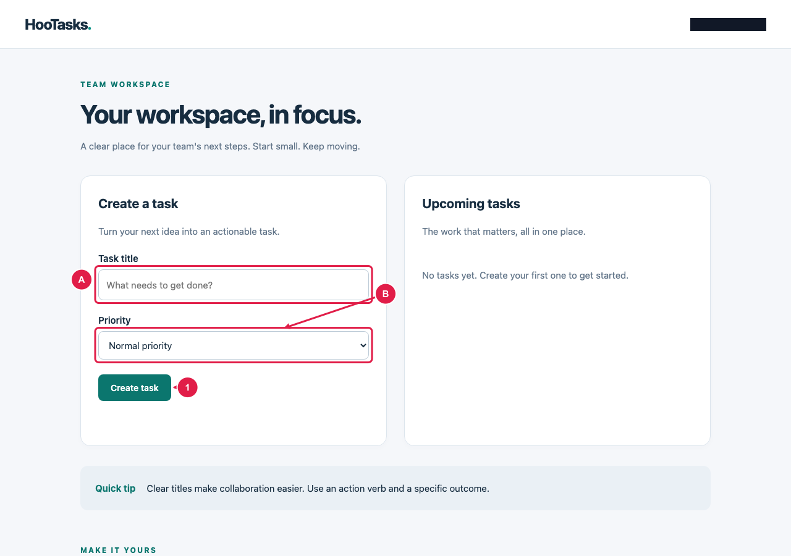

# HooTasks — Benutzerhandbuch

Handbuchversion: 1.0
Zielgruppe: Teammitglieder
Erstellt: 2026-10-04

Aufgaben anlegen, organisieren und Ergebnisse prüfen.

## Inhalt

1. Die erste Aufgabe anlegen
2. Benachrichtigungen anpassen

## 1. Die erste Aufgabe anlegen

HooTasks hält die Arbeit Ihres Teams übersichtlich. Legen Sie Aufgaben an,   prüfen Sie das gespeicherte Ergebnis und passen Sie Ihre Einstellungen an.

### Voraussetzungen

- Öffnen Sie Ihren Arbeitsbereich mit der Berechtigung, Aufgaben anzulegen.

> **Tipp:** Verwenden Sie einen kurzen Titel, der den nächsten Arbeitsschritt beschreibt.

1. Geben Sie einen eindeutigen Aufgabentitel ein und wählen Sie die Priorität.
2. Wählen Sie Create task. Prüfen Sie, ob die Aufgabe in der Liste und eine Bestätigung erscheinen.

### Aufgabendetails ausfüllen

A bezeichnet den Titel, B die Priorität. Wählen Sie Create task zum Speichern.

- **A**: Geben Sie der Aufgabe einen aussagekräftigen Titel.
- **B**: Wählen Sie eine passende Priorität für Ihr Team.
- **1**: Speichern Sie die neue Aufgabe.

### Gespeicherte Aufgabe prüfen

Die Aufgabe erscheint im Arbeitsbereich. Die Bestätigung zeigt den erfolgreichen Speichervorgang.

- **2**: Die neu angelegte Aufgabe.
- **3**: Bestätigung des erfolgreichen Speicherns.

### Aufgabenformular im Detail

Die Detailansicht hält das Formular lesbar und vergibt Referenzen automatisch.

- **A**: Der Aufgabentitel.
- **B**: Die gewählte Priorität.
- **C**: Die Speicherbestätigung.

## 2. Benachrichtigungen anpassen

HooTasks hält die Arbeit Ihres Teams übersichtlich. Legen Sie Aufgaben an,   prüfen Sie das gespeicherte Ergebnis und passen Sie Ihre Einstellungen an.

> **Hinweis:** Einstellungen werden getrennt von den einzelnen Aufgaben gespeichert.

> **Warnung:** Aktivieren Sie E-Mail-Benachrichtigungen nur für ein Konto, das Sie kontrollieren.

1. Öffnen Sie Workspace preferences, aktivieren Sie Email notifications und wählen Sie Save preferences.

### Einstellungen des Arbeitsbereichs

Die Einstellungen befinden sich unten im Arbeitsbereich. Lange Screenshots bleiben über mehrere PDF-Seiten lesbar.

- **A**: Schalten Sie Benachrichtigungen ein oder aus.
- **B**: Speichern Sie Ihre Einstellungen.
