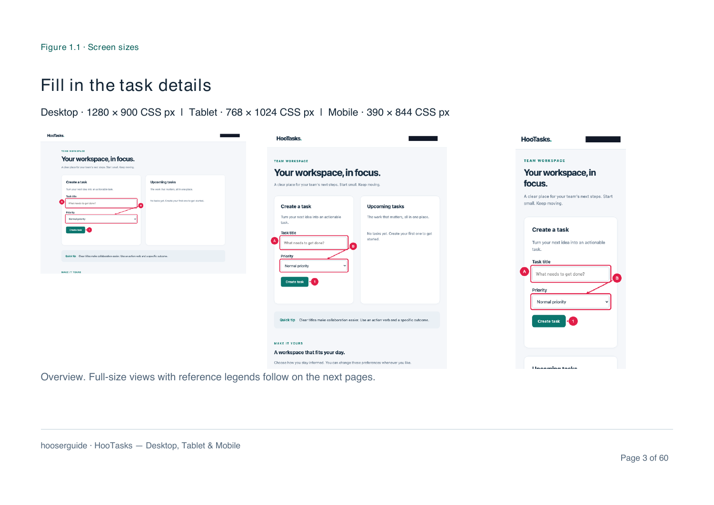

# Present a feature across screen sizes

Run the same Gherkin scenarios in two to four named browser profiles. The manual groups each scenario once and places corresponding captures in the configured order. Every screenshot has its own browser execution, assertions, annotations and privacy masks.

## Configure Desktop, Tablet and Mobile

```json
{
  "title": "Workspace — Responsive guide",
  "baseURL": "http://localhost:3000",
  "features": ["features/*.feature"],
  "output": "output/guides",
  "profiles": {
    "desktop": { "viewport": { "width": 1280, "height": 800 } },
    "tablet": { "viewport": { "width": 768, "height": 1024 }, "hasTouch": true },
    "mobile": {
      "viewport": { "width": 390, "height": 844 },
      "deviceScaleFactor": 2,
      "isMobile": true,
      "hasTouch": true
    }
  },
  "responsive": {
    "profiles": ["desktop", "tablet", "mobile"],
    "layout": "side-by-side",
    "labels": { "desktop": "Desktop", "tablet": "Tablet", "mobile": "Mobile" }
  }
}
```

`hooserguide init` creates all three profiles. Opt into a responsive run using config or `--profiles`; ordinary single-profile runs retain their behavior. Viewport dimensions in labels are **CSS pixels**. The recorded device scale factor describes browser emulation; images and annotation coordinates remain normalized to CSS pixels.

Profiles can specify their own browser and color scheme. Install every engine used by the selected profiles. Firefox supports narrow viewports and touch but does not support `isMobile: true`; omit that field when using Firefox. A narrow viewport is not proof of a physical phone or device-specific user agent.

## Run and select a feature

```sh
hooserguide validate --config hooserguide.config.json --profiles desktop,tablet,mobile --scenario "Create task" --json
hooserguide run --config hooserguide.config.json --profiles desktop,tablet,mobile --scenario "Create task" --screen-layout side-by-side --json
```

Omit `--profiles` to use the configured responsive selection. `--profile mobile` explicitly selects one profile and disables the configured comparison for that invocation. `--profile` and `--profiles` together are rejected. Profile overrides retain configured labels and layout for the selected names.

A run executes scenario one for each selected screen, then scenario two, and so on. Each scenario/profile uses a fresh browser context; backend mutations still affect the target application. Use authorized test data and idempotent workflows or a trusted reset plugin when a scenario creates records. Cancellation never rolls back completed actions.

## Choose the presentation



- **`side-by-side`:** HTML uses aligned screenshot columns with individual labels and legends. It switches to two columns at medium widths and stacks on narrow reader screens. Images link to their full-size PNG; the raw toggle changes every image and image link. Markdown uses a comparison table. PDF adds a non-cropped overview followed by readable individual views and annotation-aware continuation pages.
- **`stacked`:** Every screen appears under the preceding one in HTML and Markdown. PDF uses the large individual views without comparison overview pages.

`manual.screenLayout` / `--screen-layout` takes precedence over `responsive.layout`. Layout changes can be exported from successful existing evidence without opening the app again:

```sh
hooserguide build output/guides/run-... --output output/stacked --screen-layout stacked --json
```

When screen-specific instructions, prerequisites or callouts differ, all variant guidance is retained. Capture titles and order must match across profiles; write stable capture names in the shared scenario so that two unrelated screenshots are never paired. An incomplete or mismatched comparison fails the successful export gate.

## Use through MCP

Pass the same `responsive` and scenario/tag filters to validation and generation:

```json
{
  "responsive": {
    "profiles": ["desktop", "mobile"],
    "layout": "side-by-side",
    "labels": { "desktop": "Desktop", "mobile": "Mobile" }
  },
  "scenario": "Create task"
}
```

`hooserguide_status` exposes configured responsive selection. Generation summaries and `hooserguide_inspect_run` retain the separate execution chapters with `variant.profile`, `variant.scenario`, browser, viewport and device scale factor. Inspect captures by their **execution chapter index**, not the grouped manual chapter number. Pin the returned `runId` for review. `hooserguide_rebuild` accepts `manual.screenLayout`.

## Use through GitLab

Set `responsive` in config or supply the component inputs:

```yaml
inputs:
  profiles: desktop,tablet,mobile
  screen-layout: side-by-side
  orientation: landscape
```

The component's `browser` overrides the engine for every selected profile so that its installed engine and the run agree. Firefox still requires viewport-only mobile profiles. `profile` and `profiles` cannot be combined. Existing readiness, job-scoped artifacts, failed-run evidence and ZIP options apply to the whole comparison.

## Review the evidence

The report keeps one chapter for each scenario/profile, including its own steps, errors and captures. HTML, Markdown and PDF group those executions for presentation. Successful reports require every selected profile for each scenario, unique scenario/profile pairs and matching capture sequences. Failure or fail-fast produces evidence only; skipped scenarios record the omitted profile.

Inspect masked raw and annotated images in every profile. Check responsive breakpoints, touch-specific controls, reference positions and full-size PDF detail pages. Comparing runs matches scenario/profile pairs; bundles and rebuilds retain every variant and its original hashes. PDF comparisons are overviews, not replacements for the readable detail pages.
